```mermaid
graph TD
    A[Crypto AI Fundamentals Analyst] --> B[Project Analysis]
    A --> C[Technology Assessment]
    A --> D[Token Economics]
    A --> E[Team Evaluation]
    A --> F[Market Positioning]
    A --> G[AI Integration Analysis]
    A --> H[Regulatory Compliance]

    B --> B1[Whitepaper Review]
    B --> B2[Roadmap Assessment]
    B --> B3[Use Case Evaluation]
    B --> B4[Problem-Solution Fit]

    C --> C1[Blockchain Architecture]
    C --> C2[Scalability Solutions]
    C --> C3[Security Measures]
    C --> C4[Interoperability Features]

    D --> D1[Token Utility]
    D --> D2[Supply Dynamics]
    D --> D3[Incentive Structures]
    D --> D4[Tokenomics Modeling]

    E --> E1[Team Background]
    E --> E2[Advisory Board]
    E --> E3[Development Activity]
    E --> E4[Community Engagement]

    F --> F1[Competitor Analysis]
    F --> F2[Market Size Estimation]
    F --> F3[Adoption Metrics]
    F --> F4[Network Effects]

    G --> G1[AI Use Cases in Project]
    G --> G2[Machine Learning Models]
    G --> G3[Data Processing Capabilities]
    G --> G4[AI Governance]

    H --> H1[KYC/AML Compliance]
    H --> H2[Securities Regulations]
    H --> H3[Data Protection Laws]
    H --> H4[Cross-border Considerations]

    A --> I[Tools and Technologies]
    I --> I1[Data Analysis: Python, R]
    I --> I2[Blockchain Explorers]
    I --> I3[AI/ML Frameworks]
    I --> I4[Financial Modeling Tools]
    I --> I5[On-chain Analytics Platforms]
    I --> I6[Natural Language Processing]

    A --> J[Research Methods]
    J --> J1[Quantitative Analysis]
    J --> J2[Qualitative Assessment]
    J --> J3[Sentiment Analysis]
    J --> J4[Network Analysis]

    A --> K[Reporting and Communication]
    K --> K1[Fundamental Analysis Reports]
    K --> K2[AI Integration Assessments]
    K --> K3[Risk Evaluation]
    K --> K4[Investment Recommendations]

    A --> L[Continuous Learning]
    L --> L1[Crypto Market Trends]
    L --> L2[AI/ML Advancements]
    L --> L3[Regulatory Developments]
    L --> L4[Emerging Blockchain Tech]

    A --> M[Collaboration]
    M --> M1[Data Scientists]
    M --> M2[Blockchain Developers]
    M --> M3[Financial Analysts]
    M --> M4[Legal/Compliance Teams]

    style A fill:#f9d71c,stroke:#333,stroke-width:4px
    style I fill:#66c2a5,stroke:#333,stroke-width:2px
    style J fill:#fc8d62,stroke:#333,stroke-width:2px
    style K fill:#8da0cb,stroke:#333,stroke-width:2px
    style L fill:#e78ac3,stroke:#333,stroke-width:2px
    style M fill:#a6d854,stroke:#333,stroke-width:2px
```

1. **Tokenomics Evaluation**:

    Analyze token supply mechanics, distribution schedules, inflation rates, and burn mechanisms to assess intrinsic value.

2. **Blockchain Protocol Analysis**:

    Evaluate the functionality, scalability, security, and adoption potential of blockchain protocols.

3. **Project Team and Governance Assessment**:

    Research the credibility, experience, and track record of the development team and their governance structures.

4. **Whitepaper and Roadmap Analysis**:

    Review project whitepapers and roadmaps to understand technical feasibility, timelines, and potential challenges.

5. **DeFi Protocol Research**:

    Analyze DeFi platforms' mechanisms, yields, collateral risks, and governance tokens.

6. **On-Chain Metrics Evaluation**:

    Incorporate metrics such as active addresses, transaction volumes, staking activity, and hash rates into fundamental analysis.

7. **Competitive Landscape Analysis**:

    Compare a crypto project with competitors within its niche (e.g., Layer-1 blockchains, Layer-2 solutions, or DeFi protocols).

8. **Community Activity and Sentiment**:

    Gauge community engagement levels on forums, social media, and Discord channels as a proxy for adoption and growth potential.

9. **Market Adoption Metrics**:

    Assess metrics such as partnerships, developer activity, and dApp usage to evaluate real-world adoption.

10. **Cross-Chain Interoperability Analysis**:

    Evaluate a project’s ability to interact with other blockchains, a key factor in its growth potential.

11. **Token Valuation Models**:

    Adapt traditional valuation models or create crypto-specific ones (e.g., NVT Ratio, discounted staking rewards, or Metcalfe’s Law-based metrics).

12. **Regulatory and Legal Risk Assessment**:

    Analyze the project's regulatory risks based on jurisdiction, compliance measures, and potential legal challenges.

13. **Ecosystem Funding and Development**:

    Examine the size and deployment of development funds or grants allocated to expand the ecosystem.

14. **Smart Contract Audits**:

    Review audit reports and security assessments to identify technical risks.

15. **Macro Trends and Cycles Analysis**:

    Study how global economic conditions, Bitcoin halving cycles, and crypto-native trends affect token valuations.

16. **Event Impact Evaluation**:

    Assess the impact of events like forks, token unlocks, exchange listings, or governance votes on project fundamentals.

17. **Governance Proposal Analysis**:

    Evaluate the implications of governance proposals for the project's future direction and token holder value.

18. **NFT and Metaverse Project Fundamentals**:

    Research NFT collections, gaming projects, or metaverse platforms for unique factors like intellectual property or user engagement.

19. **Decentralized Exchange (DEX) Liquidity Analysis**:

    Analyze DEX liquidity pools, impermanent loss risks, and their implications on token price stability.

20. **Sustainability and Scalability of Incentive Models**:

    Investigate whether a project’s incentive structures for liquidity mining, staking, or other mechanisms are sustainable.

21. **Integration with Portfolio Strategy**:

    Align fundamental insights with the fund’s broader strategy, such as favoring long-term growth or high-yield opportunities.

22. **Data Visualization for Insights**:

    Create dashboards summarizing fundamental metrics, adoption trends, and risks for investors and managers.

23. **Stress Testing Fundamentals in Volatile Markets**:

    Model how adverse market conditions (e.g., regulatory bans or liquidity crises) would impact project fundamentals.

24. **Index Component Research**:

    For crypto indices, analyze the inclusion or exclusion of tokens based on fundamental strength.

25. **Long-Term Adoption Potential**:

    Focus on identifying projects or assets with strong fundamentals that align with macro crypto adoption trends.