```mermaid
graph TD
    A[Crypto AI Sentiments Analyst] --> B[Social Media Analysis]
    A --> C[News and Media Monitoring]
    A --> D[Community Engagement Metrics]
    A --> E[Market Sentiment Indicators]
    A --> F[AI-Powered Sentiment Analysis]
    A --> G[Influencer Impact Assessment]
    A --> H[Regulatory Sentiment Tracking]

    B --> B1[Twitter Sentiment]
    B --> B2[Reddit Analysis]
    B --> B3[Telegram Group Monitoring]
    B --> B4[Discord Channel Analysis]

    C --> C1[Crypto News Aggregators]
    C --> C2[Mainstream Media Coverage]
    C --> C3[Press Release Sentiment]
    C --> C4[Blog and Opinion Piece Analysis]

    D --> D1[GitHub Activity]
    D --> D2[Telegram Group Growth]
    D --> D3[Subreddit Subscriber Growth]
    D --> D4[Discord Member Activity]

    E --> E1[Fear and Greed Index]
    E --> E2[Google Trends Analysis]
    E --> E3[Exchange Inflow/Outflow]
    E --> E4[Long/Short Ratio]

    F --> F1[Natural Language Processing]
    F --> F2[Sentiment Classification Models]
    F --> F3[Emotion Detection Algorithms]
    F --> F4[Topic Modeling]

    G --> G1[Influencer Identification]
    G --> G2[Sentiment Impact Measurement]
    G --> G3[Follower Engagement Analysis]
    G --> G4[Influencer Credibility Scoring]

    H --> H1[Government Statements]
    H --> H2[Regulatory Body Announcements]
    H --> H3[Legal Expert Opinions]
    H --> H4[Policy Proposal Reactions]

    A --> I[Tools and Technologies]
    I --> I1[Social Listening Tools]
    I --> I2[AI/ML Libraries: TensorFlow, PyTorch]
    I --> I3[NLP Tools: NLTK, spaCy]
    I --> I4[Data Visualization: Tableau, D3.js]
    I --> I5[Programming: Python, R]
    I --> I6[Cloud Computing: AWS, Google Cloud]

    A --> J[Data Collection and Processing]
    J --> J1[API Integration]
    J --> J2[Web Scraping]
    J --> J3[Data Cleaning and Preprocessing]
    J --> J4[Real-time Data Streaming]

    A --> K[Analysis Techniques]
    K --> K1[Sentiment Scoring]
    K --> K2[Trend Analysis]
    K --> K3[Anomaly Detection]
    K --> K4[Predictive Modeling]

    A --> L[Reporting and Visualization]
    L --> L1[Sentiment Dashboards]
    L --> L2[Trend Reports]
    L --> L3[Alerts and Notifications]
    L --> L4[Predictive Insights]

    A --> M[Continuous Learning]
    M --> M1[NLP Advancements]
    M --> M2[Crypto Market Dynamics]
    M --> M3[New Social Platforms]
    M --> M4[Regulatory Landscape Changes]

    A --> N[Collaboration]
    N --> N1[Trading Teams]
    N --> N2[Risk Management]
    N --> N3[Marketing Teams]
    N --> N4[Product Development]

    style A fill:#f9d71c,stroke:#333,stroke-width:4px
    style I fill:#66c2a5,stroke:#333,stroke-width:2px
    style J fill:#fc8d62,stroke:#333,stroke-width:2px
    style K fill:#8da0cb,stroke:#333,stroke-width:2px
    style L fill:#e78ac3,stroke:#333,stroke-width:2px
    style M fill:#a6d854,stroke:#333,stroke-width:2px
    style N fill:#ffd92f,stroke:#333,stroke-width:2px
```

1. **Crypto Social Media Sentiment Tracking**:

    Analyze sentiment on crypto-specific platforms like Twitter, Discord, Reddit, Telegram, and niche forums (e.g., Bitcointalk).

2. **Blockchain Community Sentiment Analysis**:

    Assess sentiment within communities of specific blockchain projects by monitoring governance proposals, forum discussions, and community votes.

3. **Token-Specific Sentiment Scoring**:

    Develop sentiment scores for individual tokens based on market commentary, developer updates, and user sentiment.

4. **On-Chain Sentiment Metrics**:

    Incorporate on-chain metrics such as wallet activity, transaction volumes, staking patterns, and whale movements into sentiment analysis.

5. **AI Sentiment Tools for NLP**:

    Use AI-powered natural language processing (NLP) tools to parse large volumes of crypto-related content for sentiment signals.

6. **Regulatory Sentiment Monitoring**:

    Track regulatory announcements, enforcement actions, and policy debates to gauge sentiment shifts around compliance and legal risks.

7. **NFT and DeFi Sentiment Analysis**:

    Monitor sentiment in niche crypto areas like NFTs and DeFi protocols, paying attention to community enthusiasm or concerns.

8. **Market Manipulation Detection**:

    Identify signs of pump-and-dump schemes, coordinated FUD (fear, uncertainty, doubt) campaigns, or wash trading that could skew sentiment.

9. **Sentiment-Driven Trading Signals**:

    Generate trading signals by combining sentiment analysis with price action and volatility metrics.

10. **Event Sentiment Monitoring**:

    Track sentiment surrounding major events like token launches, hard forks, exchange listings, or protocol upgrades.

11. **Whale and Influencer Sentiment Analysis**:

    Monitor key crypto influencers and large stakeholders (whales) for their sentiment and actions, as they often sway market perceptions.

12. **Sentiment Index Creation**:

    Develop a proprietary crypto sentiment index aggregating data from various platforms and metrics for fund-wide use.

13. **Decentralized Sentiment Feeds**:

    Leverage decentralized oracles and sentiment feeds to obtain real-time sentiment data in a trustless manner.

14. **Community Sentiment Polling**:

    Create surveys or utilize tools to measure sentiment directly from crypto communities and integrate results into analyses.

15. **Sentiment for Stablecoin and Exchange Risk**:

    Monitor sentiment around key infrastructure elements like stablecoins and exchanges to predict risk events (e.g., depegging or insolvency).

16. **Integration with Algorithmic Trading**:

    Feed sentiment data into automated trading systems to enhance algorithmic strategies based on market mood.

17. **Data Visualization for Crypto Trends**:

    Build visual dashboards highlighting sentiment trends across blockchains, tokens, or market segments.

18. **Emerging Trend Detection**:

    Identify nascent trends (e.g., growing attention on a new Layer-2 solution) by analyzing changes in sentiment over time.

19. **Cross-Chain Sentiment Correlation**:

    Examine sentiment patterns across interconnected blockchains or projects to detect systemic risks or opportunities.

20. **Sentiment Anomaly Alerts**:

    Create automated systems to flag sudden sentiment spikes or dips as early warning signals for market shifts.