```mermaid
graph TD
    A[Crypto AI Technicals Analyst] --> B[Price Action Analysis]
    A --> C[Chart Pattern Recognition]
    A --> D[Indicator Analysis]
    A --> E[AI-Driven Predictive Modeling]
    A --> F[Algorithmic Trading Strategies]
    A --> G[Market Sentiment Analysis]
    A --> H[On-Chain Metrics Analysis]

    B --> B1[Support and Resistance]
    B --> B2[Trend Identification]
    B --> B3[Volume Analysis]
    B --> B4[Candlestick Patterns]

    C --> C1[Classic Chart Patterns]
    C --> C2[Harmonic Patterns]
    C --> C3[Elliott Wave Analysis]
    C --> C4[Fibonacci Retracements]

    D --> D1[Moving Averages]
    D --> D2[Oscillators]
    D --> D3[Momentum Indicators]
    D --> D4[Volatility Indicators]

    E --> E1[Machine Learning Models]
    E --> E2[Time Series Forecasting]
    E --> E3[Neural Networks]
    E --> E4[Reinforcement Learning]

    F --> F1[High-Frequency Trading]
    F --> F2[Mean Reversion Strategies]
    F --> F3[Trend-Following Strategies]
    F --> F4[Arbitrage Strategies]

    G --> G1[Social Media Analysis]
    G --> G2[News Sentiment]
    G --> G3[Fear and Greed Index]
    G --> G4[Crowd Psychology]

    H --> H1[Transaction Volume]
    H --> H2[Active Addresses]
    H --> H3[Network Hash Rate]
    H --> H4[UTXO Analysis]

    A --> I[Tools and Technologies]
    I --> I1[Trading Platforms: TradingView, MetaTrader]
    I --> I2[Programming: Python, R]
    I --> I3[AI/ML Libraries: TensorFlow, PyTorch]
    I --> I4[Data Analysis: Pandas, NumPy]
    I --> I5[Visualization: Matplotlib, Plotly]
    I --> I6[Blockchain Explorers]

    A --> J[Data Sources]
    J --> J1[Exchange APIs]
    J --> J2[On-Chain Data Providers]
    J --> J3[Market Data Aggregators]
    J --> J4[Social Media Platforms]

    A --> K[Risk Management]
    K --> K1[Position Sizing]
    K --> K2[Stop Loss Strategies]
    K --> K3[Portfolio Diversification]
    K --> K4[Volatility Adjustment]

    A --> L[Reporting and Communication]
    L --> L1[Technical Analysis Reports]
    L --> L2[Trading Signals]
    L --> L3[Market Outlook Presentations]
    L --> L4[Performance Metrics]

    A --> M[Continuous Learning]
    M --> M1[New Technical Indicators]
    M --> M2[AI/ML Advancements]
    M --> M3[Crypto Market Dynamics]
    M --> M4[Regulatory Impacts]

    A --> N[Collaboration]
    N --> N1[Quantitative Analysts]
    N --> N2[Data Scientists]
    N --> N3[Fundamental Analysts]
    N --> N4[Trading Teams]

    style A fill:#f9d71c,stroke:#333,stroke-width:4px
    style I fill:#66c2a5,stroke:#333,stroke-width:2px
    style J fill:#fc8d62,stroke:#333,stroke-width:2px
    style K fill:#8da0cb,stroke:#333,stroke-width:2px
    style L fill:#e78ac3,stroke:#333,stroke-width:2px
    style M fill:#a6d854,stroke:#333,stroke-width:2px
    style N fill:#ffd92f,stroke:#333,stroke-width:2px
```

1. **Crypto Chart Pattern Analysis**:

    Analyze price charts of cryptocurrencies, identifying patterns specific to the crypto market, such as parabolic moves or prolonged consolidation.

2. **Blockchain-Specific Technical Indicators**:

    Adapt traditional indicators or create new ones tailored to crypto markets, such as analyzing on-chain metrics alongside price movements.

3. **Support and Resistance Levels for Volatile Markets**:

    Identify key price levels in highly volatile crypto markets to provide actionable insights.

4. **Candlestick and Volume Analysis in Low Liquidity Markets**:

    Evaluate candlestick patterns and volume spikes in low-liquidity tokens to detect manipulation or genuine breakouts.

5. **DeFi and Altcoin Market Trends**:

    Perform technical analysis for DeFi tokens, altcoins, and Layer-1/Layer-2 solutions, accounting for unique market behaviors.

6. **Cross-Exchange Arbitrage Signals**:

    Monitor price discrepancies across centralized and decentralized exchanges to identify arbitrage opportunities.

7. **Token Pair Correlation Analysis**:

    Analyze relationships between token pairs (e.g., ETH-BTC) to gauge relative strength and predict price moves.

8. **On-Chain Activity Overlay**:

    Integrate on-chain data (e.g., wallet activity, staking amounts, token burns) into traditional technical analysis.

9. **Algorithmic Strategy Backtesting**:

    Backtest crypto-specific strategies using historical price data, considering unique crypto events like halving or forks.

10. **Dynamic Stop-Loss and Take-Profit Levels**:

    Develop adaptive risk management rules tailored to crypto market volatility.

11. **Trading Volume Across DEXs and CEXs**:

    Evaluate volume trends across centralized exchanges (CEXs) and decentralized exchanges (DEXs) to confirm technical setups.

12. **Crypto-Specific Momentum Indicators**:

    Create or adapt momentum indicators to account for crypto’s rapid market movements, such as tracking funding rates in futures markets.

13. **Monitoring Token Whales and Institutional Activity**:

    Analyze blockchain transactions to detect large holder activity that might precede market moves.

14. **Technical Analysis of Crypto Indices**:

    Apply technical methods to analyze crypto indices, considering the weighting and composition of index constituents.

15. **Event-Driven Technical Adjustments**:

    Factor in upcoming crypto events (e.g., protocol upgrades, airdrops, or unlocks) into technical setups.

16. **Integration with Automated Trading Systems**:

    Develop and refine automated trading algorithms tailored to crypto-specific patterns and indicators.

17. **Stress Testing in Extreme Volatility**:

    Simulate technical scenarios for extreme market conditions, such as flash crashes or regulatory announcements.

18. **Layer-1 vs. Layer-2 Technical Comparisons**:

    Compare price and trend dynamics between native Layer-1 tokens and their associated Layer-2 solutions.

19. **DEX and Liquidity Pool Analytics**:

    Incorporate DEX metrics such as liquidity depth and impermanent loss into technical decision-making.

20. **Sentiment-Enhanced Technical Analysis**:

    Combine technical signals with sentiment data to refine trading strategies, especially during news-driven market movements.

21. **Visualization Dashboards for Crypto Metrics**:

    Build real-time dashboards showcasing price trends, volume, and on-chain activity alongside technical indicators.

22. **Cross-Chain Technical Signals**:

    Develop models to identify price correlations and arbitrage opportunities across multiple blockchain ecosystems.

23. **Long-Term Trend Identification for Adoption Cycles**:

    Focus on multi-year trends tied to adoption cycles, analyzing how macro-level crypto developments impact prices.