```mermaid
graph TD
    A[Crypto AI Valuation Analyst] --> B[Data Collection]
    A --> C[AI Model Development]
    A --> D[Market Analysis]
    A --> E[Risk Assessment]
    A --> F[Valuation Modeling]
    A --> G[Reporting and Communication]

    B --> B1[Blockchain Data]
    B --> B2[Market Data]
    B --> B3[Social Media Sentiment]
    B --> B4[Economic Indicators]

    C --> C1[Machine Learning Algorithms]
    C --> C2[Natural Language Processing]
    C --> C3[Time Series Analysis]
    C --> C4[Deep Learning Networks]

    D --> D1[Trend Analysis]
    D --> D2[Competitor Assessment]
    D --> D3[Regulatory Environment]
    D --> D4[Technology Adoption]

    E --> E1[Volatility Analysis]
    E --> E2[Liquidity Risk]
    E --> E3[Regulatory Risk]
    E --> E4[Technology Risk]

    F --> F1[Discounted Cash Flow #40;DCF#41;]
    F --> F2[Relative Valuation]
    F --> F3[Network Value Models]
    F --> F4[Token Economic Models]

    G --> G1[Executive Summaries]
    G --> G2[Technical Reports]
    G --> G3[Presentations]
    G --> G4[Real-time Dashboards]

    B1 --> H[Tools and Technologies]
    C1 --> H
    D1 --> H
    E1 --> H
    F1 --> H
    G1 --> H

    H --> H1[Programming: Python, R]
    H --> H2[Data Analysis: Pandas, NumPy]
    H --> H3[Machine Learning: TensorFlow, PyTorch]
    H --> H4[Visualization: Matplotlib, D3.js]
    H --> H5[Blockchain Analysis: Chainalysis, Glassnode]
    H --> H6[Financial Modeling: Excel, Python]

    A --> I[Continuous Learning]
    I --> I1[Crypto Market Developments]
    I --> I2[AI and ML Advancements]
    I --> I3[Financial Modeling Techniques]
    I --> I4[Regulatory Changes]

    A --> J[Collaboration]
    J --> J1[Data Scientists]
    J --> J2[Financial Analysts]
    J --> J3[Blockchain Developers]
    J --> J4[Compliance Officers]

    style A fill:#f9d71c,stroke:#333,stroke-width:4px
    style H fill:#66c2a5,stroke:#333,stroke-width:2px
    style I fill:#fc8d62,stroke:#333,stroke-width:2px
    style J fill:#8da0cb,stroke:#333,stroke-width:2px
```

1. **Token and Crypto Asset Valuation**:

    Develop models for valuing crypto tokens, NFTs, and DeFi assets, accounting for unique features like tokenomics, governance utility, and staking rewards.

2. **On-Chain Data Analysis**:

    Leverage blockchain analytics tools to analyze transaction flows, wallet activity, and other on-chain data to inform valuations.

3. **Market Liquidity Assessment**:

    Evaluate liquidity risks by analyzing order book depth, trading volume, and spread across multiple exchanges.

4. **Smart Contract and Protocol Analysis**:

    Assess smart contract functionality, risks, and protocol adoption to estimate intrinsic and future value.

5. **DeFi Yield Analysis**:

    Calculate yields from staking, farming, or lending protocols and incorporate them into valuation models.

6. **Portfolio Valuation Aggregation**:

    Consolidate valuations for diverse portfolios that may include native tokens, wrapped tokens, and synthetic assets.

7. **Algorithmic Risk Mitigation**:

    Build and monitor automated tools for flagging unusual valuation discrepancies or risks.

8. **Regulatory and Tax Compliance**:

    Stay updated on evolving crypto regulatory environments and incorporate compliance measures into valuation models.

9. **Index Valuation Updates**:

    If managing indices, calculate real-time valuations for crypto index portfolios based on constituent performance and rebalancing needs.

10. **Decentralized Exchange (DEX) Valuation**:

    Account for price variations and slippage in DEXs when valuing assets traded outside centralized platforms.

11. **Stress Testing in Volatile Markets**:

    Simulate extreme market conditions (e.g., flash crashes or protocol exploits) to assess potential valuation impacts.

12. **AI and Automation Utilization**:

    Use machine learning and AI tools to enhance valuation accuracy and scalability, particularly for large and dynamic crypto portfolios.

13. **Cross-Chain Asset Valuation**:

    Evaluate assets that operate across multiple blockchains, considering interoperability and bridge risks.

14. **Token Governance Participation Analysis**:

    Incorporate governance token voting power and outcomes into valuation metrics.

15. **Reconciliation Across Pricing Feeds**:

    Validate crypto asset prices across multiple sources like CoinGecko, Chainlink Oracles, and other APIs to ensure consistency.

16. **Audit Trail Maintenance**:

    Provide transparent and immutable audit trails for valuation methodologies using blockchain or off-chain systems.